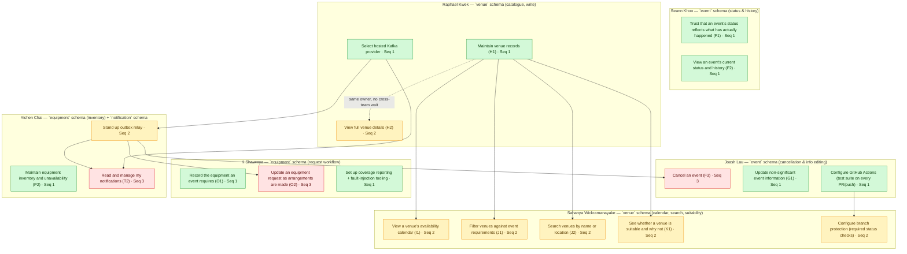

# Sprint 2 Overhaul — Draft

**Status: draft, not merged into `plan.md`.** This file proposes a Sprint 2 plan, plus two standing
planning rules, for the team to review before anything is folded back into `plan.md` or
`implementation.md`. Story codes are unchanged. `CHANGELOG.md` remains the record of what actually
happened once Sprint 2 runs — this file is the plan going in, not a report of what came out.

Story titles and codes below follow the mapping in `documentation/sprint allocation.csv`. No story
code is renamed anywhere in this document.

---

## Summary

This plan partitions work along two separate axes, and it's worth being explicit that they're
independent of each other:

- **Which sprint a piece of work belongs in (§1.2, §5).** The CRUD consolidation rule keeps one
  feature's full set of operations in a single sprint unless a named dependency forces a split
  (§5.1). Its second half governs when a *group* of related features that share the same
  underlying data are allowed to be staged across different sprints — again, only with the
  dependency written down (§5.2). This axis decides timing. It says nothing about who does the
  work.
- **Which developer does a piece of work, within one sprint (§2).** Once Sprint 2's story list is
  fixed by the rule above, §2's table assigns each story to one developer by the specific data it
  owns that sprint, so two developers' Sprint 2 work can't block each other. This axis only
  operates inside a single sprint — it doesn't decide whether something ships in Sprint 2 or later.

Put plainly: **the sprint-to-sprint splits (§1.2, §5) are about data and features being staged over
time; the developer assignments (§2) are about data being split between people within one sprint.**
The two never determine each other — a story's sprint doesn't decide who owns it, and who owns a
story doesn't decide which sprint it's in.

---

## 0. Problems with how Sprint 1 was planned

Sprint 2 is planned differently because three things were missing from how Sprint 1 was planned.
Naming them here is what motivates the two standing rules in §1.

**1. No check that a feature's full set of operations stayed in one sprint.** Sprint 1 assigned
stories by feature area, but nothing checked whether splitting a feature's Create, Read, Update, or
Delete across sprints was ever necessary, or would have been just a load-balancing choice dressed
up as one. Without that check, a split can happen by accident and nobody notices until a teammate
goes looking for a screen or an action that "should" be there and finds it was quietly deferred.

**2. No data ownership map between developers.** Sprint 1's assignment happened by each developer
picking a feature area during the planning call. That works when everyone happens to pick areas
that don't overlap, but nothing was actually checked — no one wrote down which database tables each
person's stories would read or write, so there was no way to confirm two people's stories couldn't
block each other before the sprint started.

**3. Cross-cutting infrastructure work had no owner and no points.** Choosing a Kafka provider and
building the outbox relay (the mechanism that turns a database write into a published event) were
never their own backlog items — they were assumed to happen alongside feature work. They didn't:
by the end of Sprint 1, outbox rows were being written but nothing was publishing them, so every
notification a story was supposed to send never actually left the database.

Sprint 2's plan below is built to close all three gaps directly: §1.2 checks feature splits, §2
assigns work by data ownership per developer, and §5 (in the sprint table) gives every piece of
infrastructure work its own row, owner, and points.

---

## 1. NEW: Two standing rules for sprint planning

These are written as rules the team can paste into `plan.md`'s general rules. They apply to every
future sprint's planning, not only Sprint 2.

### 1.1 Infra-shakeout sequencing rule

> During any sprint where core infrastructure is still being built, do not schedule a story whose
> functionality or required tests depend on infrastructure that doesn't exist yet. Check this at
> Planning Poker, before a story is assigned to anyone — not after someone discovers mid-sprint that
> their story can't be tested.

**Why this matters, concretely:** in Sprint 2, three stories — Cancel an event (F3), Update an
equipment request as arrangements are made (O2), and Read and manage my notifications (T2) — each
have an acceptance criterion that requires sending a notification. None of those notifications can
actually be sent until the Kafka provider is chosen and the outbox relay is built. §2 sequences
those two infrastructure items first in the sprint, specifically so this doesn't get discovered
partway through Sprint 2 the way it was discovered partway through Sprint 1.

### 1.2 CRUD consolidation rule

> **Keep a feature's operations together.** Deliver a feature's entire set of operations — create,
> read, update, delete, whichever apply — within one sprint wherever possible. Splitting a feature's
> operations across sprints (build the create/read screen now, the update/delete screen later)
> fragments the feature, and counts as a planning defect unless a real dependency forces it.
>
> **Name any split you can't avoid.** This applies whether the split is one feature's own
> operations, or a group of related features that happen to share the same data. Before staging
> anything across more than one sprint, write down the specific reason next to it. A reason like
> "this needs data another not-yet-built feature produces" is valid. "It made the sprints more even"
> is not a valid reason on its own — if a split is really about balancing sprint size, say that
> plainly instead of dressing it up as a dependency.

**A concrete example of the problem this rule catches:** imagine a story called *Trust that an
event's status reflects what has actually happened (F1)* ships in one sprint, and a related
story — *Confirm an event only when venue and equipment are ready (F5)* — ships two sprints later,
with no explanation written anywhere for why they were split apart. Anyone who worked on F1 would
reasonably think that feature was finished once F1 shipped. Two sprints later, F5 turns out to have
been part of the same behaviour the whole time, and nobody flagged it. That's the failure mode this
rule exists to prevent.

**How the same example passes the rule properly:** F5 needs two other stories to exist first —
*Approve a venue booking request (M1)* and *Reserve equipment for an event (Q1)* — because F5
checks whether a venue is actually booked and equipment is actually reserved before letting an event
be confirmed, and neither of those things can be true until M1 and Q1 exist. That dependency is
written down next to the split (see §5.1), so the split is a named, deliberate decision instead of
something someone has to notice on their own later.

---

## 2. Sprint 2 plan

### 2.1 Dependency diagram

Each box below is one **developer**, not one schema — grouping is by who owns the work, and by the
specific data that developer owns within it. A schema can, and does, span more than one box here:
the `event` schema is split between Seann Khoo's box and Joash Lau's box, the `venue` schema is
split between Raphael Kwek's box and Sahanya Wickramanayake's box, and the `equipment` schema is
split between K Shawmya's box and Yichen Chai's box. Every box's label now names the schema (or
schemas) it touches, in backticks, so this doesn't have to be inferred from the description alone.

An arrow points from something that has to land first to something that depends on it — **the box
an arrow starts from must be finished before the box it points to can be finished.** Colour and the
"Seq" number on each box show the same thing a second way: green boxes (Seq 1) can start
immediately, amber boxes (Seq 2) need one green box to land first, and red boxes (Seq 3) need an
amber box to land first.

**Reading the arrows:** a solid arrow is a real blocker — the person working on the box it points to
genuinely cannot finish (or in some cases, cannot even start testing) until the box the arrow starts
from is done. The one dotted arrow, from *Maintain venue records (H1)* to *View full venue details
(H2)*, is different: both are owned by the same person, so it's just their own work order, not
something that blocks a teammate.

The five items without a story code (Select hosted Kafka provider, Stand up outbox relay, Configure
GitHub Actions, Configure branch protection, Set up coverage reporting + fault-injection tooling)
are infrastructure and CI work, not user-facing stories — see §2.2 for why they're listed and
pointed the same way stories are.

### 2.2 Sprint 2 backlog table

| Task | Owner | Data owned this sprint | Blocked by | Notification/infra dependency | Points |
|---|---|---|---|---|---|
| Trust that an event's status reflects what has actually happened (F1) | Seann Khoo | Event status and transition history — the elapsed-time completion check and refusal-message edge cases only; the underlying transition rule and history table were already built in Sprint 1 | None | No | **5** *(see §4 for why)* |
| View an event's current status and history (F2) | Seann Khoo | Event status and history — read-only | None | No | 2 |
| Cancel an event (F3) | Joash Lau | Event status (set to Cancelled) and history | Outbox relay | **Yes** — cancellation notifies the organiser, coordinator, venue staff, and tech support | 3 |
| Update non-significant event information (G1) | Joash Lau | Event descriptive fields (purpose, description, accessibility notes, contact details) and history | None | No | 3 |
| Maintain venue records (H1) | Raphael Kwek | Venue records, room layouts, operating hours — write access | None | No | 3 |
| View full venue details (H2) | Raphael Kwek | Same venue data as H1 — read-only | Maintain venue records (H1) — same owner, not a cross-team block | No | 2 |
| View a venue's availability calendar (I1) | Sahanya Wickramanayake | Confirmed bookings, pending requests, and recorded unavailability for a venue — read-only | Maintain venue records (H1) — needs the venue data to exist | No | 5 |
| Filter venues against event requirements (J1) | Sahanya Wickramanayake | Venue records, bookings, and holds — read-only | Maintain venue records (H1) | No | 5 |
| Search venues by name or location (J2) | Sahanya Wickramanayake | Venue records — read-only | Maintain venue records (H1) | No | 2 |
| See whether a venue is suitable and why not (K1) | Sahanya Wickramanayake | Venue records (read-only) and the event's own recorded requirements (read-only, via the Event service's API) | Maintain venue records (H1) | No | 5 |
| Record the equipment an event requires (O1) | K Shawmya | Equipment request lines — created by the coordinator | None | No | 3 |
| Update an equipment request as arrangements are made (O2) | K Shawmya | Equipment request lines — status updated by technical support | Outbox relay | **Yes** — a status change notifies the coordinator | 3 |
| Maintain equipment inventory and unavailability (P2) | Yichen Chai | Equipment types and unavailability records — write access | None | No | 3 |
| Read and manage my notifications (T2) | Yichen Chai | Notification records and each user's read state | Kafka provider selection, outbox relay | **Yes** — the whole story is unusable without both | 2 |
| Select hosted Kafka provider | Raphael Kwek | — (infrastructure decision) | None | Yes (this item is the dependency) | 2 |
| Stand up outbox relay | Yichen Chai | — (infrastructure, shared by every service) | Kafka provider selection | Yes (this item is the dependency) | 5 |
| Configure GitHub Actions (run the test suite on every PR and push to `main`) | Joash Lau | — (CI configuration) | None | No | 3 |
| Configure branch protection (require passing status checks) | Sahanya Wickramanayake | — (repository configuration) | Configure GitHub Actions | No | 1 |
| Set up coverage reporting + fault-injection tooling | K Shawmya | — (testing infrastructure) | None | No | 3 |

**Points: 46 for the 14 user stories, 14 for the 5 infrastructure/CI items, 60 total.** None of the
infrastructure points are folded into any story's estimate — each infrastructure item is its own
row with its own owner, which is what §0's third gap asked for.

### 2.3 Sprint goal

**By the end of Sprint 2, an event's status can be trusted end to end, and the venue and equipment
sides of planning an event are both usable.** Concretely, this sprint should let an Event
Coordinator: trust that an event's status and history reflect what actually happened to it, cancel
an event and have every affected person notified, browse and vet a venue against an event's
requirements from a real venue catalogue, and get an equipment request moving with Technical
Support Staff able to act on it. Underneath that, the infrastructure the rest of the project
depends on — a chosen Kafka provider, a working outbox relay, CI running on every pull request, and
coverage/fault-injection tooling — is stood up and usable by anyone building Sprint 3 on top of it.

This ties the fourteen stories together into one push: everything above is either part of an event
becoming trustworthy and cancellable, part of a venue becoming searchable and bookable-ready, part
of equipment intake becoming usable, or part of the infrastructure that makes the notifications in
all three actually work.

---

## 3. Why the sequencing matters

Three stories — Cancel an event (F3), Update an equipment request as arrangements are made (O2),
and Read and manage my notifications (T2) — each need a notification to actually be sent as part of
passing their own acceptance criteria. Sending a notification needs the outbox relay, and the outbox
relay needs a Kafka provider chosen first. That chain is why §2.1 draws an arrow from Select hosted
Kafka provider, to Stand up outbox relay, to all three of those stories.

This doesn't mean those three stories are stuck doing nothing in the meantime. The underlying logic
in each — cancelling an event, changing a request's status, displaying a notification list — can be
built and unit-tested without a working relay. What's blocked specifically is the notification
acceptance criterion, and a story isn't finished until every one of its acceptance criteria passes.
So in practice: put Select hosted Kafka provider and Stand up outbox relay at the very top of the
Sprint 2 backlog order, even though the table lists them further down — the goal is for that work to
already be done by the time anyone needs it.

---

## 4. Re-pointing Trust that an event's status reflects what has actually happened (F1)

The current estimate for F1 is 5 points, already reduced once from an original 8 because a related
piece of work — the confirmation check — was carved out into its own story, *Confirm an event only
when venue and equipment are ready (F5)*, which now ships later. What's left unaccounted for is a
second fact: the underlying status-transition rule and the table that records status history were
already built in Sprint 1, as a byproduct of three other stories (Create and submit an event
request, Resume edit and submit a draft, and Review the queue of submitted event requests) all
needing to change an event's status.

What actually remains for F1 in Sprint 2, once both of those are subtracted:

- A scheduled check that moves an event to Completed once its recorded end time has passed.
- Refining the refusal message shown when someone attempts a status change that isn't allowed.
- Any transition edge case not already exercised by the three Sprint 1 stories above.

**F1 stays at 5 points.** Two things keep it from being smaller: the scheduled Completed-check is a
different kind of work than an ordinary endpoint — it's a recurring background job with its own
failure modes (an event that gets missed, a job that runs twice and double-writes) — and every story
in Sprint 2 carries more testing work per point than Sprint 1's stories did, which §6 explains.

---

## 5. The CRUD consolidation rule applied to Sprint 2

### 5.1 One feature's own operations, kept together or split with a reason

Trust that an event's status reflects what has actually happened (F1) and Confirm an event only
when venue and equipment are ready (F5) are the one case in this plan where a feature's operations
are split across sprints — F1 in Sprint 2, F5 in Sprint 4. As explained in §1.2, this is not a
load-balancing split: F5 cannot run until *Approve a venue booking request (M1)* and *Reserve
equipment for an event (Q1)* both exist, and neither exists until Sprint 3 finishes. That reason is
written down here, which is what the rule in §1.2 requires.

Every other feature in Sprint 2 keeps its full set of operations together. Maintain venue records
(H1) delivers create, update, and read for a venue record in one story. Record the equipment an
event requires (O1) and Update an equipment request as arrangements are made (O2) — creating a
request and then changing its status — ship in the same sprint rather than being separated.

### 5.2 Related features sharing the same data, staged in dependency order

Two groups of features are staged across Sprint 2 and Sprint 3 because they share the same
underlying data, and the later group genuinely cannot be built before the earlier group exists.

**Venue data:** Maintain venue records (H1), View full venue details (H2), View a venue's
availability calendar (I1), Filter venues against event requirements (J1), Search venues by name or
location (J2), and See whether a venue is suitable and why not (K1) ship in Sprint 2. Submitting a
venue booking request, approving or rejecting one, placing a tentative hold, and detecting booking
conflicts all ship in Sprint 3. The reason: none of the Sprint 3 booking or conflict-checking work
can operate against a venue that doesn't exist in the catalogue yet — the catalogue has to be built
first.

One specific case worth calling out on its own: View a venue's availability calendar (I1), in
Sprint 2, displays recorded venue unavailability (for example, a maintenance closure), but *Record a
period of venue unavailability* — the only story that actually creates one of those records — ships
in Sprint 3. This isn't the same problem as F1/F5, because I1 doesn't own that data at all; it's a
read-only screen that displays whatever three separate features have written into the venue
schedule (confirmed bookings, tentative holds, and unavailability records). I1 ships in Sprint 2
with a tested, correct view of an empty unavailability list, which fills in once Sprint 3's
unavailability story lands.

**Equipment data:** Record the equipment an event requires (O1), Update an equipment request as
arrangements are made (O2), and Maintain equipment inventory and unavailability (P2) ship in
Sprint 2. Checking equipment availability and reserving equipment ship in Sprint 3, for the same
reason — reservation needs an inventory and an intake process to already exist.

Both cases are staged deliberately, with the dependency named here rather than left for someone to
guess at later. That's the full discipline the standing rule in §1.2 asks for: it does not require
every feature that touches the same data to ship in the same sprint — doing that here would force
all nine of Sprint 3's venue stories into Sprint 2, nearly doubling it in size. It only requires
that a split be named, which both of these now are.

---

## 6. Why Sprint 2's estimates run heavier than Sprint 1's

Every story in Sprint 2 now includes writing and reviewing its own tests against its acceptance
criteria (covering the normal case, the boundary cases, and the failure cases), reviewing a coverage
report and running fault-injection checks to catch assertions a happy-path test would miss, and
extending a shared end-to-end test file that has to keep passing as every other story extends it
too. None of that was expected of every story in Sprint 1, whose stories were checked off using
manual test cases only. That raises the floor on every estimate. A few concrete comparisons:

- Update non-significant event information (G1), a single-screen edit with history recording, is
  pointed at 3 — the same as Review the queue of submitted event requests, a full queue screen, was
  in Sprint 1 — despite being a smaller feature, because G1 now carries its own boundary and
  failure-path tests that the Sprint 1 story didn't have to.
- Record the equipment an event requires (O1) and Update an equipment request as arrangements are
  made (O2), both straightforward create/update stories, are pointed above Approve an event request
  and Reject an event request, comparably-sized Sprint 1 stories that were worth 1 point each,
  because fault-injection testing on their "a reason is required" refusal paths is now expected, not
  optional.
- Maintain venue records (H1) is pointed above Save an incomplete event request as a draft, a
  comparable single-entity create in Sprint 1 worth 2 points, for the same reason: reviewing a
  coverage report to catch missing assertions is now part of finishing the story, not something
  extra.

If Sprint 2 still runs over its 60-point estimate, that's a signal the team under-estimated again,
worth saying plainly at the retrospective rather than carried quietly into Sprint 3.

---

## 7. Rewriting the shared end-to-end test file

`implementation.md` currently describes one shared file, `flow.spec.ts`, built at the start of a
sprint and treated as a single gate everyone waits on before the sprint can be called done. This
section proposes replacing that description with the following, to match how testing now works
story by story (§0 and §6):

> ### `flow.spec.ts` — a living regression file
>
> `flow.spec.ts` is not a single end-of-sprint gate everyone waits on. It is a living file: one
> browser test per sprint (`/tests/flows/sprint-<n>/flow.spec.ts`) that starts as the sprint's first
> story's journey through the system, and grows as each further story reaches Done.
>
> **How a story extends it:**
>
> 1. At sprint planning, before any story starts, the sprint's first files are created:
>    `flow.md` (the journey so far, written as numbered steps), `seed.sql` (the test data that
>    journey needs), and an initial `flow.spec.ts` covering whatever the first story needs.
> 2. Every following story's pull request extends `flow.spec.ts` with that story's own slice of the
>    journey — the steps a user would take to reach and use that story, added wherever they belong
>    in the existing file.
> 3. The whole file has to stay passing. A story is not finished if its addition breaks a step that
>    a different, already-finished story wrote. This is what catches one person's change breaking
>    someone else's work — it now happens on the day it happens, on the pull request that caused it,
>    instead of being discovered all at once at the end of the sprint.
> 4. `flow.md` is updated in the same pull request as `flow.spec.ts`, so the written description and
>    the test never drift apart.
> 5. The sprint's traceability file still records one row per acceptance criterion; a story's row
>    can now point at either its own dedicated test or the shared `flow.spec.ts`, whichever one
>    actually checks that criterion.
>
> **What this replaces:** waiting for every story to finish, then testing all of them together at
> the end. A story is finished based on its own tests and its own passing CI check — it does not
> wait on any other story. `flow.spec.ts` stops being the thing that makes a story finished, and
> becomes the thing a story is not allowed to break.
>
> **Coverage and fault-injection, not just a passing test:** a passing `flow.spec.ts` and a passing
> unit test suite are necessary, but not enough on their own. Before opening a pull request, a
> story's author reviews the coverage report for the code they touched to find assertions a
> happy-path test missed, and runs the sprint's fault-injection tooling against their story's
> refusal paths — for example, a dependency that times out, a duplicate message, or two requests
> writing to the same record at once — to confirm the refusal actually gets exercised, not just that
> it exists in the code. A passing test suite that never runs a failure path is not evidence that
> the failure path works.
